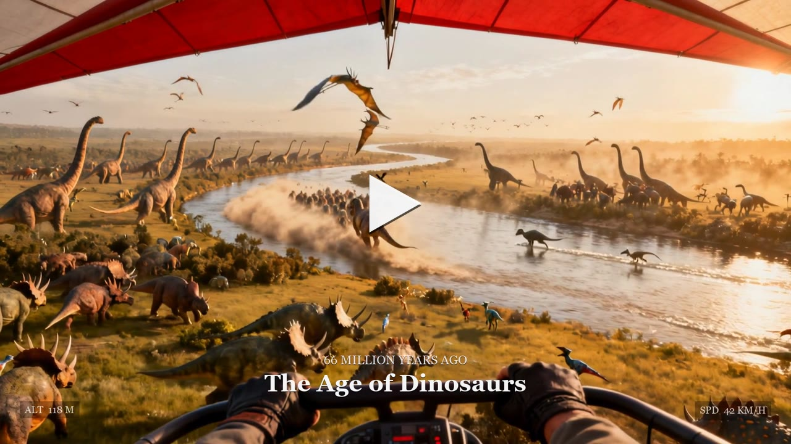
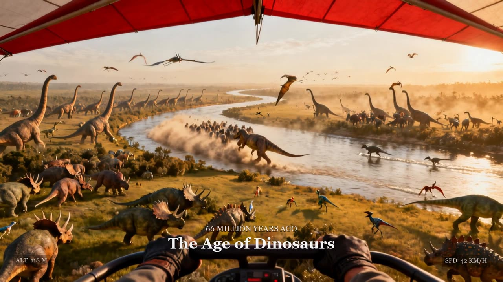

# Glider Through Time

**A non-coder and Claude Fable 5 set out to build a 3D game — and, after two false starts and one honest reckoning about what a browser can and can't do, ended up making a photoreal film that flies across the entire arc of history.**

This repository is both the project and its story.

---

## The film

A **45-second continuous flight** through ten eras — from the primordial ocean to the Wright brothers at Kitty Hawk, 1903. Click to play:

[](https://az9713.github.io/fable-5-video-creation/assets/film-web.mp4)

*It also plays in the hero of the [live journey](https://az9713.github.io/fable-5-video-creation/).*

| | |
|---|---|
| **Deliverable** | one 45-second, 1080p film |
| **Total spent** | **$4.30** of a $5.35 budget |
| **Eras** | 10, every one animated on the first try |
| **Retake budget used** | $0.00 |

---

## ▶ View the live development journey

The full, illustrated case study — every decision, every fork, and the reasoning behind it — is published as a live web page:

### **https://az9713.github.io/fable-5-video-creation/**

[](https://az9713.github.io/fable-5-video-creation/)

*(GitHub can't run interactive HTML inside a README, so the page above is the rendered version of [`journey/index.html`](journey/index.html) — a cinematic, scrollable page with a live flight-instrument HUD, before/after comparisons, and both light and dark themes.)*

---

## How it was made

The visuals are **AI-generated video**, not real-time rendering — because that is what the target look actually required. The pipeline was deliberately cheap-first:

1. **A population spec per era** — counted, layered prompts ("hundreds of sauropods to the horizon…"), because models draw empty landscapes by default.
2. **Keyframe first** — each scene begins as a single **Seedream V4** still (~$0.03). Wrong composition? Retry the cheap image, not the expensive video.
3. **A density gate** — no still advances to video until it is genuinely *full*.
4. **Then animate** — the approved still is brought to life by **Kling 2.5 Turbo Pro** image-to-video (~$0.35 / 5 s).

Both models were called on **[fal.ai](https://fal.ai)** over plain HTTP. Assembly — captions, HUD overlay, transitions, procedural wind audio — was done locally and free with **ffmpeg**.

### The three decisions that shaped everything

- **Why not the browser game (geometric HTML)?** Real-time browser rendering has a hard ceiling far below the reference. The Three.js flythrough in this repo works and is playable, but it can never *be* photoreal — from the glider, its world is cones and capsules.
- **Why not Higgsfield?** Pricier per output, credits sold in expiring packs, and reachable only through an MCP connector that kept dropping mid-session. Wrong economics and wrong reliability for a $5 budget.
- **Why fal.ai?** Roughly 2–3× more output per dollar, billed per successful image or second of video, callable over plain HTTP with a key in a local `.env` — every request visible and auditable.

The full reasoning, with the arithmetic and the before/after images, is in the [live journey](https://az9713.github.io/fable-5-video-creation/).

---

## What's in this repository

```
journey/          The illustrated development-journey showcase (served by GitHub Pages)
  index.html      Self-contained page — cinematic, themed, with a live scroll HUD
  assets/         Web-optimised video, keyframes, and comparison images
film/             The film + its production pipeline
  glider_through_time_compat.mp4   The finished 45s film
  stills/         The 13 AI keyframes (10 final + iteration passes)
  storyboard.mjs  Generates all keyframes on fal.ai
  animate.mjs     Animates every keyframe into a clip
  assemble.mjs    Stitches, captions, and scores the film with ffmpeg
src/              The playable Three.js browser flythrough (the "geometric" prototype)
docs/plans/       The original design docs and the 16-phase → lean-10 plans
```

Excluded from the repo: `node_modules/`, the heavy intermediate `film/clips/`, and — always — the `.env` holding the API key.

---

## The collaboration

The interesting artefact isn't the film — it's the division of labour. The human owned **taste, direction, and truth** (the vision, the veto, historical accuracy, the budget); Fable 5 owned **research, building, and explanation** (the brainstorm, the code, the prompts, the honest pushback). The human never touched the code, the API, or the prompt syntax.

The through-line: the AI was most useful not when it agreed, but when it **pushed back with reasons** — on the plan, on the graphics ceiling, on the platform — and turned each fork into a real choice with costs attached.

---

## Credits & attribution

- **Video** generated with [fal.ai](https://fal.ai) — Seedream V4 (image) and Kling 2.5 Turbo Pro (video).
- **Dinosaur models** in the browser prototype: [Quaternius](https://quaternius.com/) (CC0), via poly.pizza.
- **Reference frames** used only for visual comparison in the journey are stills from a video by [@tyrtyre201 on X](https://x.com/tyrtyre201/status/2065469711190536464); all rights remain with the original creator.
- Built with [Claude Code](https://claude.com/claude-code) (Claude Fable 5) · [Three.js](https://threejs.org) · [Vite](https://vitejs.dev) · [ffmpeg](https://ffmpeg.org).

🤖 Generated with [Claude Code](https://claude.com/claude-code)
